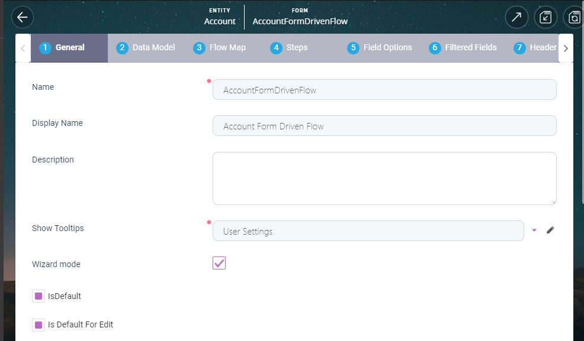

# Form driven flow

Form-driven flows allow you to manage an entity record at inserting or editing time using several steps. You can create a step map that shows steps only when certain conditions are met. If needed, you can control whether a step will show based on certain conditions, and indicate the destination following the execution of the last step in a form-driven flow.

## Create form-driven flow

### Prerequisites

1. Entity whose records the form-driven flow will either insert or edit.
2. Any data extensions (see [Extend the data model](../../evolutive-data-core/data-model-explorer/extend-data-model) for more details).

### Step 1: Define form driven flow

1. From **Digital Experience** in the menu, click **Digital Journeys > Form Driven Flows.** The **Form Driven Flows** page appears.

2. At the top-left corner of the page, click the **Create** button. The form driven flow configuration page appears, showing two tabs at the top. The **General** tab opens by default.

3. Fill out the **Name** field -- provide a form-driven flow name in the Name field, and then press Enter. The **Display Name** is filled with the **Name** value.
4. Optionally, change **Display Name**, and **Description** fields.
5. Tick **Wizard** on.

6. Click the **Data model** tab to show data model properties.
7. In the **Entity** field, choose the entity whose attributes the form driven flow will use.

8. Click **Save and Reload** icon at the top-right corner to save the form driven flow definition and reopen the form driven flow properties dialog. The form-driven flow properties now has several additional tabs.

 or,

  Click **Save and Close** icon at the top-right corner to save the form-driven flow definition and return to form driven flow list.

### Step 2: Set default behavior

1. Select the **General** tab -- it will be available in the form-driven flow properties unless you clicked **Save and close** or **Save and new**.

2. If you want to use this form-driven flow as the entity default form for inserting records, tick **Is default** on.
3. If you want to use this form-driven flow as the entity default form for editing records, tick **Is default for edit** on.
4. Click **Save and reload** at the top-right corner to save form-driven form properties and continue editing the properties.

### Step 3: (Optional) Use roles to restrict form driven flow use

Use this step if you want to restrict form-driven flow's use to only those users who have the roles you choose in this step.

:::note
When there are no roles in the **Security** tab, all roles can use the form-driven flow.
:::

To add roles allowed to use this form-driven flow:

1. Select the Security tab.
2. Click **Add role**: the list of existing role appears.
3. In the list of existing roles, tick the check box for the roles you allow to use the form-driven flow, and click the **OK** button at the top of the list.
4. In **Security** tab, the list of roles allowed to use the form-driven flow show the roles you selected.

To remove roles allowed to use this form-driven flow:

1. Select the **Security** tab.
2. In the list of roles allowed, tick the checkbox to select the roles to remove.
3. Click the **Remove existing**.
4. The list of allowed roles no longer shows the roles you removed.

### Step 4: Save form driven flow definition

Click **Save and Reload** icon at the top-right corner to save the form-driven flow definition and reopen the form driven flow properties dialog. The form-driven flow properties now has several additional tabs.

 or,

  Click **Save and Close** icon at the top-right corner to save the form driven flow definition and return to form driven flow list.

## Modify form-driven flow

To edit a form-driven flow:

1. From **Digital Experience** in the menu, click **Digital Journeys > Form Driven Flows.** The **Form Driven Flows** page appears.

2. Locate the form-driven flow in the list. If you know any of the form-driven details, use the list header filters to quickly view candidate items.
3. Double-click the row in the list of the form-driven flow to modify. The form-driven flow properties dialog appears, and you can use the tabs to view properties you want to modify.
4. Click **Save and Reload** icon at the top-right corner to save the form-driven flow definition and reopen the form-driven flow properties dialog. The form-driven flow properties now has several additional tabs.

 or,

  Click **Save and Close** icon at the top-right corner to save the form-driven flow definition and return to form driven flow list.

## Add form driven flow steps

## Custom processor step

## Action step

## Flow control

## Configure field options

## Define form actions

## Define action groups

## Flow map

## Define filtered fields

## Header items

## Link labels to attribute

## Display view from another entity

## Render custom data extensions

## Create custom search forms

